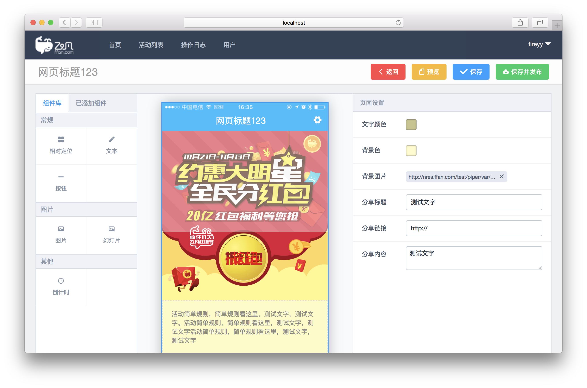

# piper

<p align="center">
  
</p>

> A drag-and-drop mobile website builder base on Vue.

### Install

```shell
npm install
```

### Config

First of all，create a database `piper` in `Mysql`.

Then set up `.env` file with your `Mysql` database connection details and qiniu upload config.

```shell
cp env.sample .env
```

### Develop

```shell
npm run dev
```

### A message about px to rem

```css
// `px` is converted to `rem`
.convert {
    font-size: 16px; // converted to 1rem
}

// `Px` or `PX` is ignored by `postcss-pxtorem` but still accepted by browsers
.ignore {
    border: 1Px solid; // ignored
    border-width: 2PX; // ignored
}
```

### Changelog

#### 1.0.5

- Login with Github base on [Passport.js](http://passportjs.org/).
- Use [Sequelize.js](http://docs.sequelizejs.com/) for Database dialects.
- Use [Axios](https://github.com/mzabriskie/axios) instead of vue-resource.
- fix issues.
